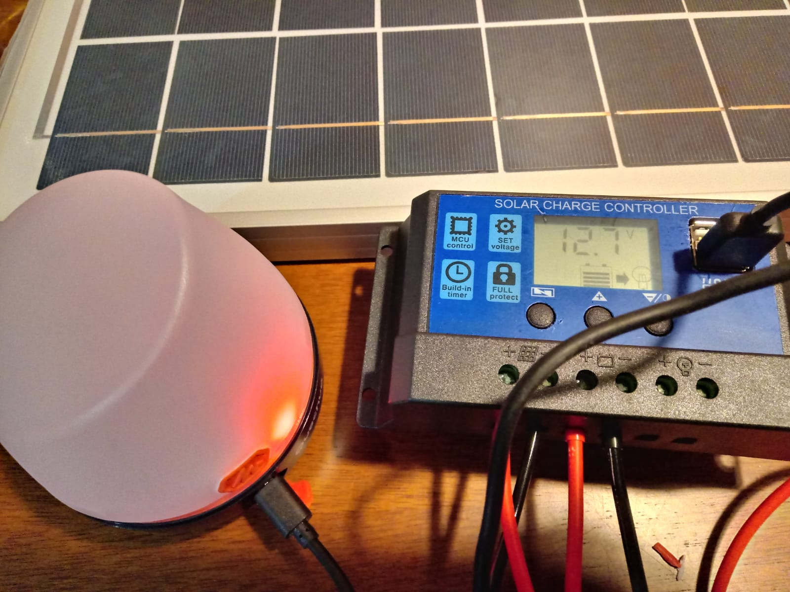

# Projeto usando uma placa fotovoltaica de 20W

# Indicação
* Carregar aparelhos e lâmpadas de baixo consumo até 12v.
Não foi utilizado inversor de corrente nesse projeto pela baixa capacidade de geração de energia. 
Valor total gasto: R$ 405,00

# Capacidade
Painel: 8.33A
Bateria: 3.5A

# Tempo de Carregamento Completo
5 horas de sol pleno

# Implementação e Teste de Carga do Sistema
https://youtu.be/WdAXKtaMGNY

# Componentes
## Placa Fotovoltaica Policristalina 20W

<h1 align="center">
  
</h1>

<h1 align="center">
  
</h1>

<h1 align="center">
  
</h1>

## Controlador de Carga PWM 10A

<h1 align="center">
  
</h1>

<h1 align="center">
  
</h1>

## Bateria Estacionária 12v 7A

<h1 align="center">
  
</h1>

<h1 align="center">
  
</h1>

## Cabos com Adaptador
* Cabo flex preto com adaptador (negativo) 
* Cabo flex vermelho com adaptador (positivo) 

<h1 align="center">
  
</h1>

# Ferramentas necessárias

* Chave philips pequena
* Alicate

# Como montar

1. Observe os símbolos do controlador de carga acompanhados de + (positivo) e - (negativo). O simbolo do meio é da bateria, o da esquerda da placa e o da direita para lâmpadas.

2. Conectar os cabos positivo(vermelho) e negativo(preto) no controlador de carga e apertar os parafusos. Se o cabo não tiver adaptador na ponta, basta desencapar a ponta dos fios e parafusar.
** Atenção para não inverter as voltagens **

<h1 align="center">
  
</h1>

3. Conectar a outra ponta dos cabos na bateria. 
Recomenda-se utilizar conexões removíveis na bateria, adaptadores ou garras de jacaré. Nesse ponto o display do carregador de carga deve ligar e mostrar a voltagem do sistema e nível da bateria.

<h1 align="center">
  
</h1>

4. Cortar a ponta dos cabos da placa com alicate até expor o fio 

5. Conectar os cabos positivo e negativo da placa no controlador de carga e parafusar, atenção para as voltagens.

<h1 align="center">
  
</h1>

Após esse passo a montagem do sistema está concluída.

Quando a placa está no sol e o sistema em carregamento, o controlador de carga mostra o ícone da placa piscando e ícone da bateria carregando.

<h1 align="center">
  
</h1>

# Teste
Para testar foram utilizados dispositivos de baixo consumo.
Como este sistema não possui inversor de corrente, os dispositivos devem ser ligados via  cabo USB.

## Tablet
<h1 align="center">
  
</h1>

## Lanterna
<h1 align="center">
  
</h1>

## Fone
<h1 align="center">
  
</h1>

# Manutenção
A manutenção desse sistema é simples e de baixo custo.

* Limpar a placa periodicamente
* Evitar descarregar a bateria a níveis menores que 50% para proteção da vida útil. 

